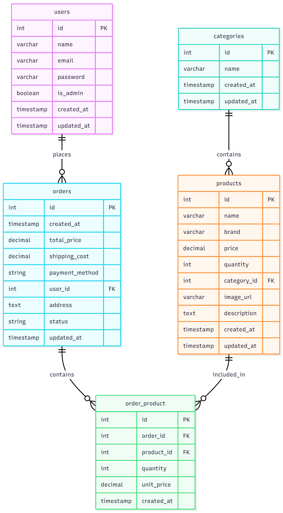

# watchify
Web Programming 

## Database Diagram

### Database Schema

The Watchify e-commerce application uses a MySQL database with the following structure:

- **users**: Stores user information including admin status
- **categories**: Product categories (Men, Women, Kids)
- **products**: Product details with pricing and inventory
- **orders**: Order information with shipping and payment details
- **order_product**: Junction table for many-to-many relationship between orders and products

### Key Relationships

- Users can place multiple orders (One-to-Many)
- Categories contain multiple products (One-to-Many)
- Orders can contain multiple products through the order_product junction table (Many-to-Many)
